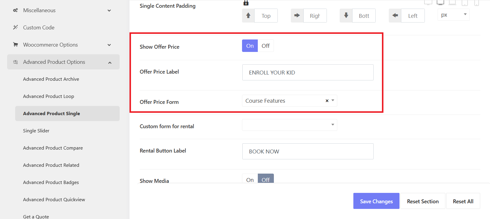

# Enrolment Form

## Edit / Customize the enrolment form
 
The enrolment form was created with WPForms, so you can go to WP-admin > WPForms > Create a new form or edit the prebuilt "Course Feature" form.

> Refer to the WPForms' documentation to learn more about the configurations: [https://wpforms.com/docs/](https://wpforms.com/docs/)

## How to assign a form as an enrolment form

In the single class pages, when clicking on "ENROL YOUR KID", there is a popup form appearing. To change this form, please go to **Kandei Options > Settings > Advanced Products options > Advanced Products Single**

* Show Office Price: Enable this option
* Offer Price Label: Change the button text
* Office Price Form: Choose a form from WPForms. Or you can also choose **Custom** option. Then add a shortcode of your custom form. 

> To change the form's CTA button, you can edit it in the Class Features form in WPForms. 

