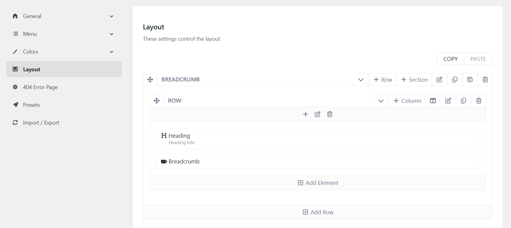

# How to remove the breadcrumb heading or breadcrumb path

If you don't want to show the Breadcrumb's heading or the breadcrumb path in the Breadcrumb section, just need to go to Kandei Options > Templates > Open a template (ex: Our Classes)> Layout.
Then remove the Heading or the Breadcrumb element in the layout. 

