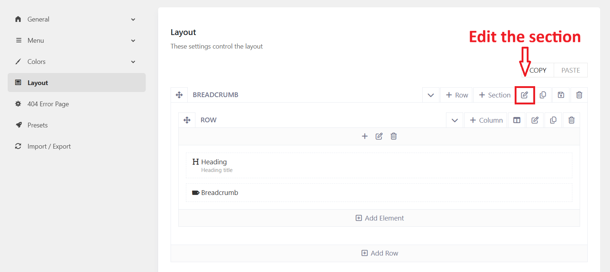
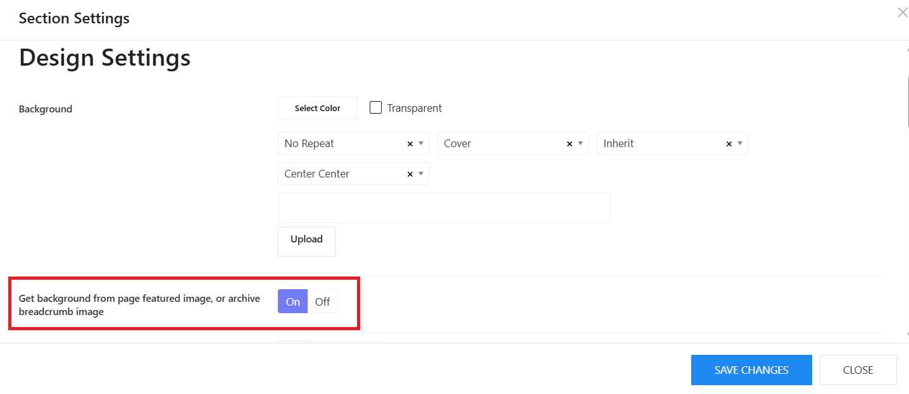
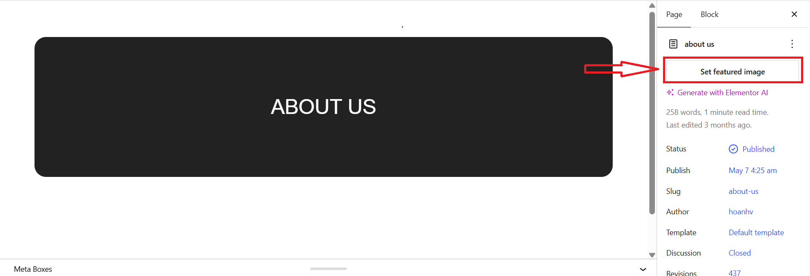

# How to change a breadcrumb image

You can see a breadcrumb section available on inner pages and it contains a background image.

So to change this background image, please go to Kandei Options > Templates > Open each template.

* You should go to Kandei Options > Templates > ex: Our Classes > Layout.
* Edit the Breadcrumb section > Design Settings tab > Change the background image. 

1. Get background from page featured image, or archive breadcrumb image: If you upload a featured image for a page, this option will display the featured image in the breadcrumb section. 
2. Background Overlay: Change the background overlay of the breadcrumb image 
3. Background Overlay Gradient Top: Set the gradient color top
4. Background Overlay Gradient Bottom: Set the gradient color bottom
5. Border: Adjust the breadcrumb's border
6. Border Radius: Set the border radius of the breadcrumb image. If you don't want the border radius, set 0 for all.

## Create different breadcrumb images on various pages

In case you're not fond of having the same breadcrumb image on many pages, you can refer to my below suggestion.

### Enable the Featured Image option

You can go to Kandei Options > Templates > Edit a template assigned to your page. Ex: The About Us page is assigned to **No Sidebar** template. Then you're supposed to edit No Sidebar template. 

* Edit No Sidebar template > Layout > edit Breadcrumb section > Design settings tab > Enable **Get background from page featured image, or archive breadcrumb image**. 

### Upload Featured Image

After enabling the option, you should go to Pages > edit a page (assigned to the template above) > Upload Featured Image. 

### Another Solution

* You can duplicate a template, and change its breadcrumb image 
* Go to Pages > Edit your page > Assign the page to a corresponding template by choosing a TemPlaza style.
