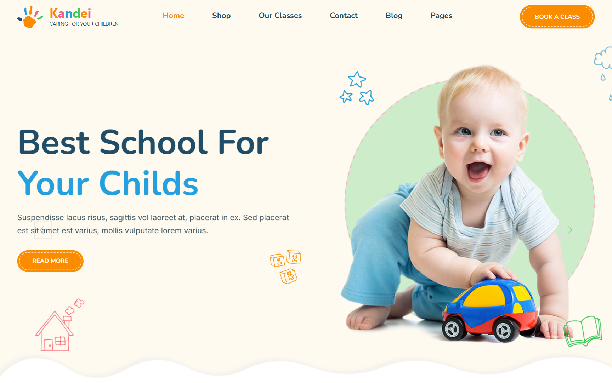

# Kandei WordPress Theme Document

**Kandei - School & Kindergarten WordPress Theme**

Kandei – Kindergarten & School WordPress Theme is a vibrant, modern, and professionally designed WordPress theme tailored for kindergartens, preschools, daycare centers, nursery schools, elementary schools, children’s education centers, and online learning platforms. Featuring a clean, engaging interface and flexible customization options, Kandei makes it easy for educational organizations to establish a warm, professional, and trustworthy online presence.

Powered by Elementor, Kandei lets you build and customize your website effortlessly with an intuitive drag-and-drop editor. The theme comes with professionally designed homepage variations and essential inner pages, along with features for managing events, teacher profiles, class schedules, galleries, blog posts, contact forms, and more.

Fully responsive and optimized for SEO and performance, Kandei is designed to work smoothly across all devices and supports the latest WordPress version. Whether you’re launching a kindergarten, preschool, daycare, children’s academy, or online education website, Kandei provides a complete and flexible solution to create a professional website without requiring coding skills.

## Installation & Demo Import

:::tip[Installation & Demo Import]

1. [Theme Installation](../../framework/activation-demo-import/theme-installation.md)
2. [Theme License Activation](../../framework/activation-demo-import/theme-activation.md)
3. [Import Demo Content](../../framework/activation-demo-import/import-demo.md)

:::

## Header Settings

:::tip[Header Settings]

1. [Header](../../framework/header/header.md)
2. [Header Variations](../../framework/header/header-variations.md)
3. [Logo & Favicon](../../framework/header/logo-favicon.md)
4. [Header Icons](../../framework/header/header-icon.md)
5. [Contact Information](../../framework/header/contact-information.md)
6. [Header Presets](../../framework/header/header-presets.md)

:::

## Footer Settings

:::tip

1. [Create a footer](../../framework/footer/creat-footer.md)
2. [Copyright Information](../../framework/footer/copyright.md)
3. [How to copy Footer from one layout to another](../../framework/footer/copy-footer.md)
4. [Footer For Multilingual Site](../../framework/footer/footer-multi.md)

:::

## Fundamental

:::tip[Fundamental]

1. [Smooth Scroll](../../framework/fundamentals/smooth-croll.md)
2. [Back To Top](../../framework/fundamentals/backtotop.md)
3. [Coming Soon](../../framework/fundamentals/coming-soon.md)
4. [Preloader](../../framework/fundamentals/preloader.md)
5. [Cursor Effect](../../framework/fundamentals/cursor-effect.md)
6. [404 Error Page](../../framework/fundamentals/error-page.md)
7. [Custom Code](../../framework/fundamentals/custom-code.md)

:::