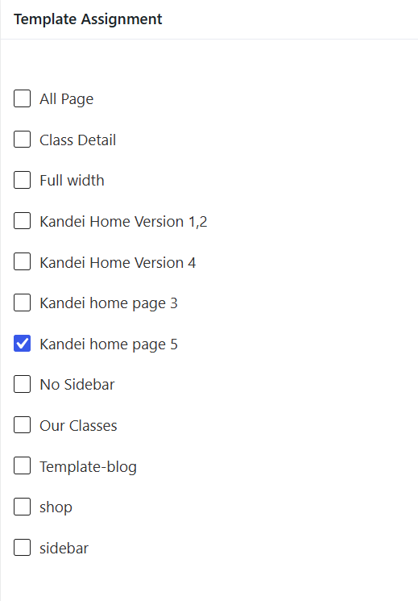

# Header Assignment

Please go to Kandei Options > Headers > You can see prebuilt Headers. 

- Header Home Version 5: Assigned to Home version 5
- Header Home Version 1,2: Assigned to Home version 1, Home Version 2
- Default: Assigned to other pages

Please edit a header > you will see Template Assignment section. 
Here you can assign the Header to any templates available, so those templates will inherit the header style

It's possible to have different header styles for different pages. You just need to assign headers to specific templates.

In case, you would like to have only one header for the whole website, just remove other redundant headers, or mark one header as default. 

