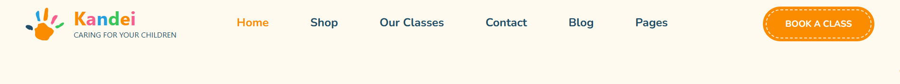
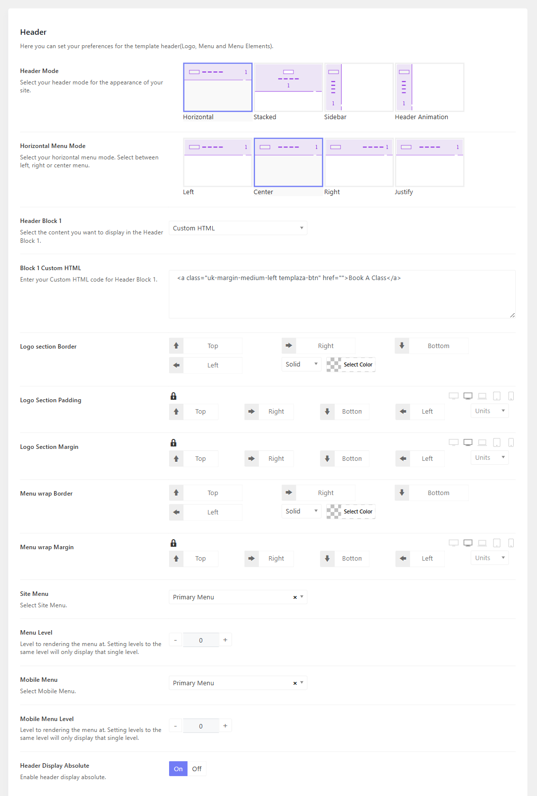
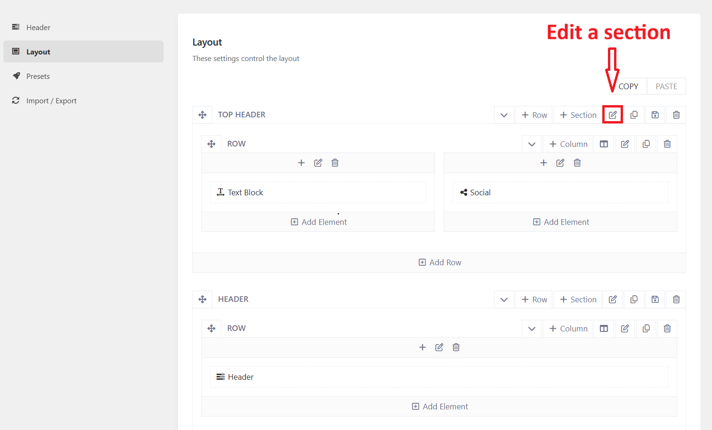
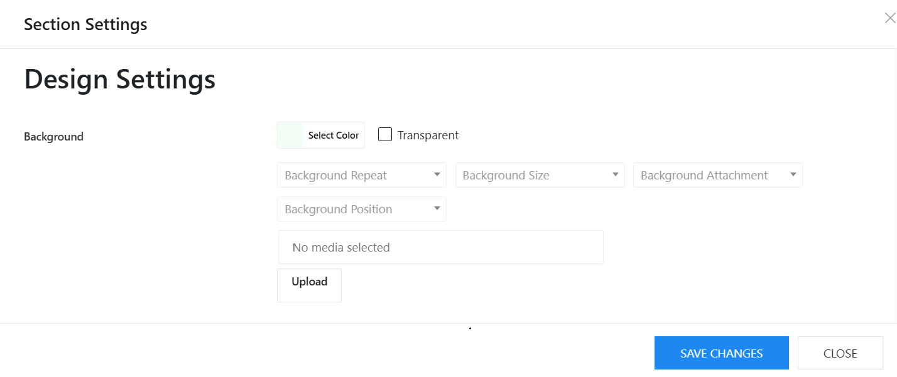
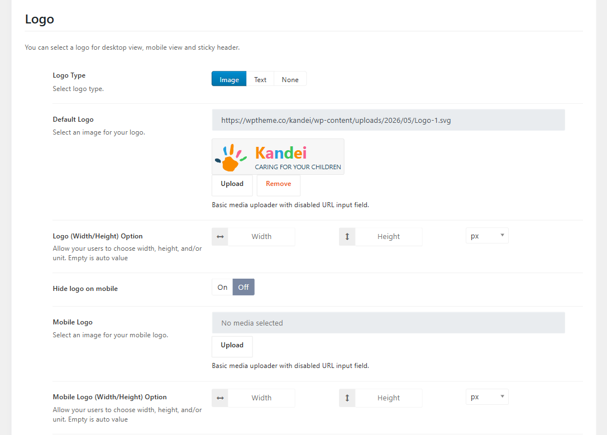
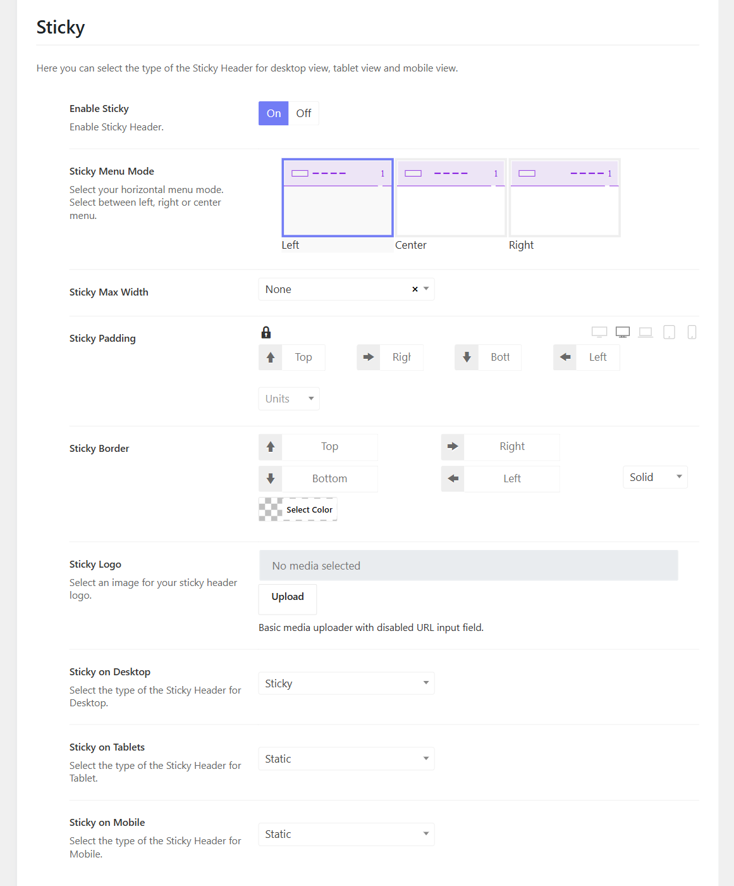

# Theme's Header

You can go to Kandei Options > Headers > There you can see some prebuilt header templates.

Open a header template, you will see options to configure the header logo, header layout and others.

## Header modes

There are many header modes for you to choose from, including Horizontal, Stacked, and Sidebar.

## Header Block 1

Block 1 is a position where you can place a widget, contact info, and a custom html, It can be on the right of a horizontal menu, below the stacked menu, and at the bottom of the sidebar menu.

To change the **Book A Class** button in the header, you can edit **Block 1 Custom HTML**

## Transparent Header

If you're interested in a transparent header, you can enable option "Header Display Absolute"

## Header Background

To change a header background, you can edit a header > Layout > edit a corresponding section > Design Settings tab > Change background color. 

## Header Top

To edit the contact info in the topbar, please edit a corresponding header > layout > edit text block of the topbar section. 

About social icons, you should go to Kandei Options > Settings > Social > manage your social profile. 

## Default & Mobile Logo

Please go to **Kandei Options > Headers > Open your header template > Header >** Scroll down the Logo section, choose logo type and change the default logo, and mobile logo.

You can adjust the logo's size by configuring the logo width and height options (If it doesn't help, kindly contact the support team.)

## Sticky Logo

Below the Logo section, you can also enable the sticky logo option, then upload the sticky logo and configure options.

