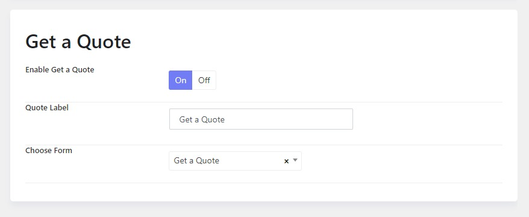
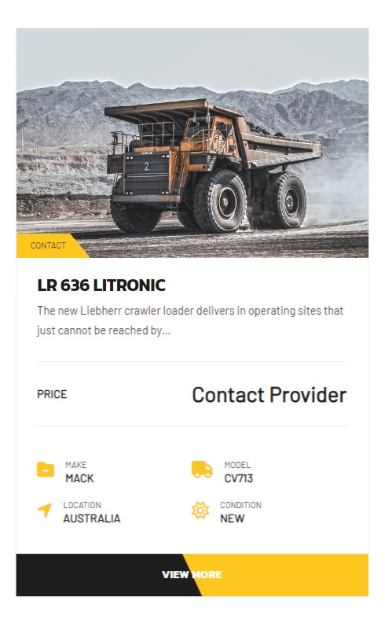

# FAQs

## 1.How to change a section's background image


There are some sections of the theme containing background images, so to edit it, you're supposed to edit a page with Elementor. 


Scroll down to the section you need > Click on the background and right mouse click > Click to edit container > Style tab > Change background image.


## 2.Edit the Background image of breadcrumb section

To edit the background image of the breadcrumb section, you're supposed to edit both the default layout in Settings, and layouts of templates.

Please go to WP-admin > Koer Options > Settings > Layout > Edit the Breadcrumb section > Design settings > Change / upload background image

After changing the background image in the Settings, please move to the Templates section > edit your template > Layout > Edit Breadcrumb section > Design settings > Background image.


Edit Breadcrumb section in a layout


## 3.How to disable the Get A Quote

In case you're not interested in showing Get A Quote on the sidebar, you can disable it. 

Please go to **WP-admin > Koer Options > Settings > Advanced Products Options > Get A Quote >** Turn off the option.



## 4.Where can I change the field icons

You should go to **Advanced products > Custom fields >** Navigate and edit each field > you'll be able to change the field's icon, or icon image.




## 6.How to remove the slashes among menu items

This is a theme's style for the main menu, you can add the custom css below to remove them. 

```
body .templaza-nav>.menu-item{ 
border:none; 
}
```
Please go to Plazart Options > Settings > Custom Code > Custom css > add the custom css there. 

