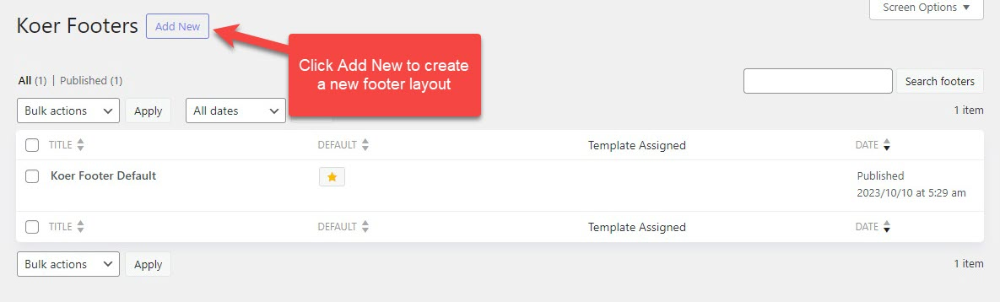
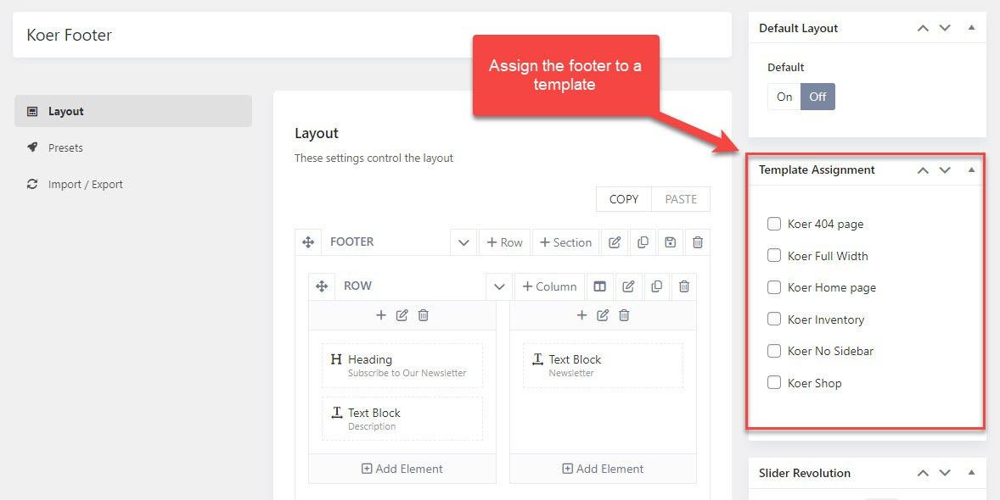

# Footer

## Create a new footer layout

Besides the default prebuilt footer layout, you are capable of adding new footer layouts in case you wish to have different footer styles on different pages. 

Please go to WP-admin > Koer Options > Footers > Click Add New. 

## Footer assignment

When creating a footer layout, you'll see a Template Assignment on the right like the screenshot above. In case you have different footer layouts, you're supposed to assign them so that they can be applied properly on different pages.

But if there is only one footer layout, you don't need to assign it to templates, just set the footer to default. Then it'll be applied to the whole site.

## Copyright

To edit the copyright, please go to **WP-admin > Koer Options > Settings > Miscellaneous > Copyright.** 

Here you're able to change the copyright's content with plain text or html is accepted. 

## Manage the copyright's position in the footer layout

The theme empowers you with the capability of managing elements in the footer, including the copyright. 

You can go to **Koer Options > Footers > Open your footer > Layout**, here change the copyright's position by dragging the element. 

