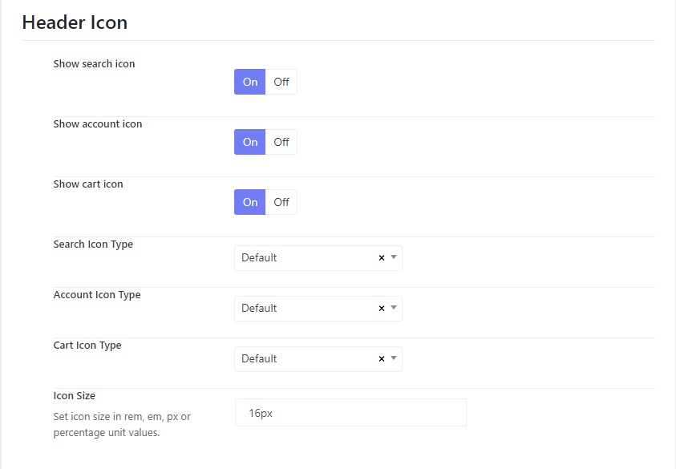

# Header

## Header Mode

Going to WP-admin > Koer Options > Headers > Koer Header Default > Header, you'll see available options for the main header.

* **Header Mode:** There are 3 primary header modes that you can choose: Horizonal, Stacked and Sidebar.
* **Menu Mode:** After choosing a header mode, you can select a specific menu mode accordingly.
* **Header Block 1:** Choose a widget to display in the block 1 position.
* **Logo Section Border:** Adjust the border top, right, bottom, and left, border type and border-color
* **Logo Section Padding:** Adjust the padding top, right, bottom, and left of the logo section.
* **Site Menu:** Assign a menu to the default site menu
* **Menu Level:** Set a level to render the menu at. Setting levels to the same level will only display that single level.
* **Mobile Menu:** Assign a menu to the mobile menu
* **Mobile Menu Level:** Set a level to render the menu on mobile view. Setting levels to the same level will only display that single level.
* **Header Display Absolute:** Enable this option if you want the header to be transparent.

## Header Icons

You can display the search, cart and login icons on the header of the theme. Please go to WP-admin > Koer Options > Headers > Koer Header Default > Header > Scroll down to the Header icons section.

Here you will see options to hide or show icons, change icon types and adjust icons' size.

## How to change the info on the header

To change the address, email and phone number on the header, please go to Wp-admin > Koer Options > Settings > Miscenlaneous > Contact. You'll see contact info to edit. And you're also able to enable or disable Login and Register.

