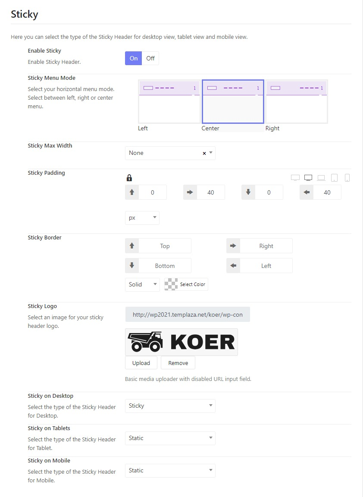

# Default & Sticky Logo

## Change the default logo

Please go to Wp-admin > Koer Options > Headers > Koer Header Default > Header > Scroll down to the Logo section > Change the logo. 

Here you can change the logo on desktop and mobile view.

## Change the sticky logo

Below the default logo, you can see the Sticky section to change the sticky logo and configure related options. 

* **Enable sticky:** Here you can enable or disable the sticky header.
* **Sticky menu mode:** Choose a sticky menu mode that will align menu items to the left, right or center.
* **Sticky max-width:** Choose a max-width size for the sticky header.
* **Sticky padding:** Adjust the padding top, right, bottom, and left of the sticky header.
* **Sticky border:** Set the border top, right, bottom and left of the sticky border. You can also choose a border type and set its color.
* **Sticky logo:** Upload a logo for the sticky header
* **Sticky on desktop:** Choose an option for the sticky header on a desktop view (Static, sticky or sticky on scroll up).
* **Sticky on tablet:** Choose an option for the sticky header on a tablet view (Static, sticky or sticky on scroll up).
* **Sticky on mobile:** Choose an option for the sticky header on a mobile view (Static, sticky or sticky on scroll up).

## Change the logo's background color

To change the logo's background color, please go to Wp-admin > Settings > Colors > Header > Change the background logo section.

