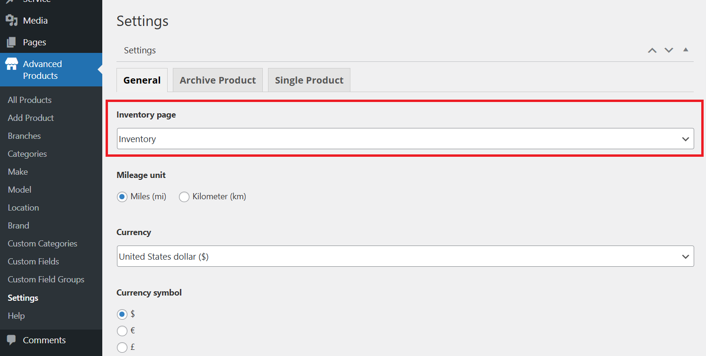

# Inventory Assignment

## Inventory page

Go to Pages > Navigate the Inventory page or you can create a new one. Choose the TemPlaza style "Koer inventory".

## Inventory assignment

After creating an inventory page, you should go to WP-admin > Advanced Products > Settings  General tab. 

Choose the inventory page you created above, then save. 

