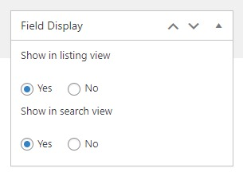

# Inventory Page

We built the inventory data with Advanced Products plugin, so you should make sure this plugin is installed on your site.

> This page is not included in the page list because it is created by a custom link.

## 1.Create product branches

**Creating a product branch is compulsory**, so you should not miss this step. Please go to WP-admin > Advanced Products > Branch

On the left, you will see a form to create a new branch, let's enter the branch name and other info. 

Group field assignment: You should assign the branch to one or more custom group fields that are (are) created in the Custom Group Field section. 

## 2.Create custom field groups

Advanced Products uses field groups to attach fields to each product. 

* Please go to WP-admin > Advanced Products > Custom Field Group
* You will see a form on the left to create a new Field Group. Enter the name of the field group and other info.
* Associated Branch: Select one or more branches that connect with the field groups.

## 3.Create product's custom fields

To create new custom fields, you should go to WP-admin > Advanced Products > Custom Fields > Add New

* Input a field label, and choose a field type.
* Required? Choose Yes if this field is compulsory, otherwise, choose No.
* Icon: choose an icon for the field. Leave it blank if you uploaded an icon image.
* Icon image: upload an icon image for the field chosen to be displayed in the listing view.

Icon image will be displayed on the list view like this: 

### 3.1 Many different field types

You can choose between 25 different input types to add to custom fields, including text boxes, number fields, dropdown lists, checkboxes, radio buttons, image swatches, color swatches, date fields, and file upload.

* **Text** – A normal text input field to collect single-line text
* **Text area** – To collect multi-line text
* **Email** – An input field to accept only email addresses
* **Password** - A single-line text field whose value is obscured. Will alert a user if site is not secure.
* **URL** – A text field to accept only links (URLs)
* **Number** – A number field to accept both decimal or whole numbers
* **Select (drop-down)** – A dropdown field to select one option from a list of options
* **Checkboxes** – To choose one or more options
* **Radio buttons** – To select one option from multiple options
* **True/false** – A single “yes or no” checkbox, which you usually know from “accept the terms of conditions” fields
* **Paragraph** – If you want to add static blocks of text in between input fields, this does the trick!

### 3.2 Custom field groups assignment

Besides protected custom fields (Video, Gallery, Category, Branch, and Price), all new custom fields created should be assigned to specific field groups. 

### 3.3 Configure field display

By configuring the field display options, you can decide whether the custom field is shown in the listing view and search view or not. 

Choose to display the field in listing and search view

