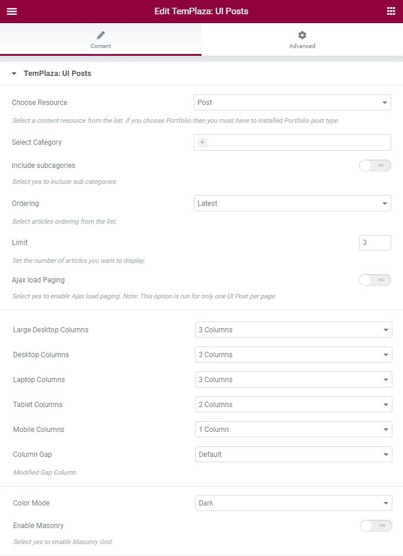
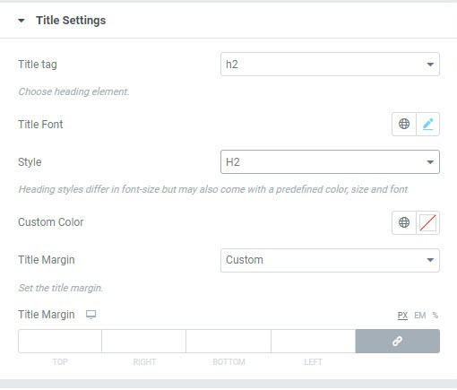
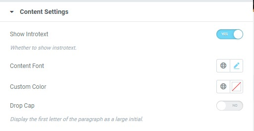
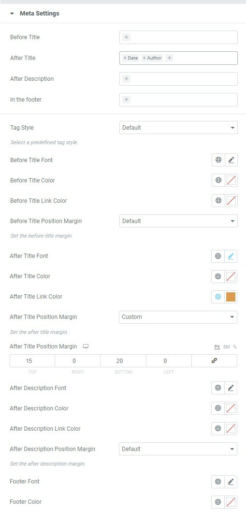

# Blog Columns

Blog columns are created with Elementor, so please go to this page > click edit with Elementor.

The page's content is built with TemPlaza: UI Post, click on it to edit the element's options.

## Adjust the number of article columns

By editing the TemPlaza: UI Posts, please configure the columns on Large desktops, Desktops, Laptops, Tablets, and Mobile phones.

## Title Settings

Please go to the title settings, you'll see options to adjust the blog article's title including: title heading tag, title font, style, custom color of title, and title's margin.

## Content Settings

* Show or hide introtext
* Content font: edit the article's font
* Custom color: change the color of the content's text
* Drop cap: enable the option if you want to display a large capital letter in the paragraph

## Meta Settings

Select elements (Date, Author, Tags, Category) for different positions Before title/After title/After description/and In the footer.

