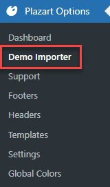
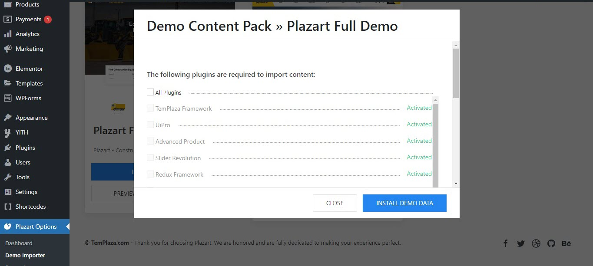
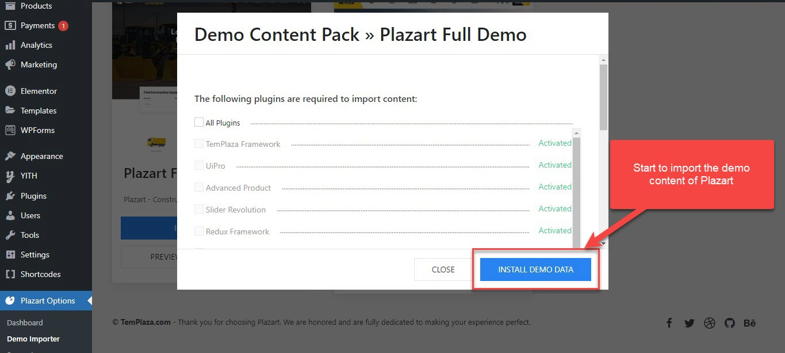
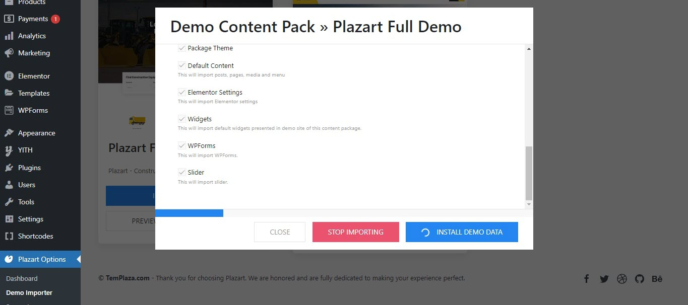
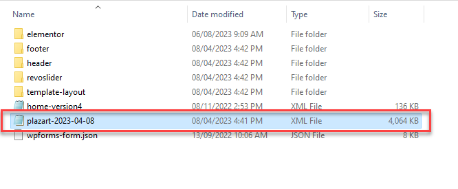

# Demo Import

After activating the Plazart theme's license, please go to the Demo Importer tab to import the demo content of Plazart theme.

When it comes to Plazart, you'll be able to import the demo content of Plazart or Koer theme. Click on **"Install Demo Data"** button to start the import process.

## I.Import the demo with 1-click Installer

**Install required plugins**

When you click on "Install Demo Data", a popup will appear and show you a list of required plugins. You should install and activate them first. 

> If you don't install all the required plugins, the demo will not be imported completely. 

After all the required plugins are installed and activated, you should choose all the content types and click on "Install Demo Data" to start importing. 

The import is in progress. It just takes a few minutes and you should wait until it's completed.

## II.Import Data Package Manually

In case importing with 1-click is not successful, you can try te manual way by installing the xml file. 

* Go to wp-admin -> Tools -> Import -> WordPress (Run Importer)
* Choose import file and click “Upload file and import”

After extracting the theme package, you will see the xml file in the "Data import" folder. 

Locate the xml file and upload it

## III.Configure Home Page and Elementor

### 1.Configure Home Page

* Go to wp-admin -> Settings -> Reading -> Your homepage displays
* Select “A static page” -> Homepage: select “Home”

### 2.Disable Default Fonts and Colors

Go to wp-admin -> Elementor -> Settings -> General Tab -> Check “Disable Default Colors” and “Disable Default Fonts”

### 3.Configure Main Menu

Go to wp-admin -> select “Main Menu” -> Check Primary Menu -> Save Menu.

> After all, you can go to the front end and check whether everything displays properly or not.

