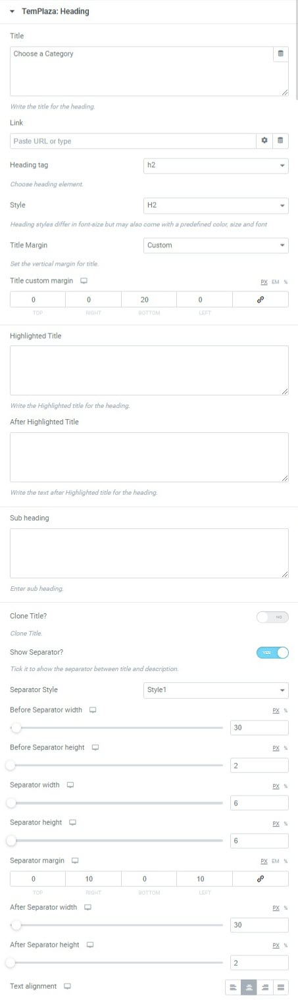
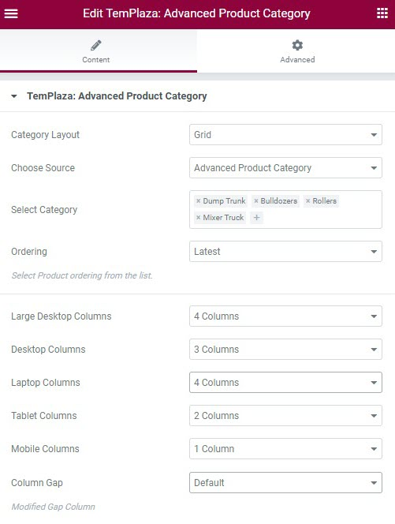
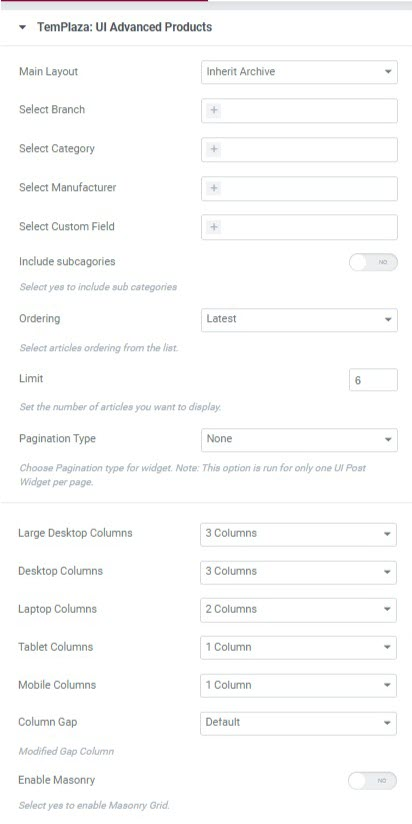

# Home Page

The page is built with Elementor, so to edit it, please click on Edit with Elementor and start to edit the corresponding elements.

## Product Filter

This filter is built with TemPlaza: UI Advanced Product Filter.

* Title: Enter the filter title
* Select custom fields: select custom fields that you want to display in the filter (Custom fields of advanced products)
* Sumit text: Change the text of the submit button "Search"
* Submit icon: Choose an icon that will be displayed in the front of the submit text

## Choose A Category

### Choose A Category heading

* Show separator: disable the option if you're not interested in showing the separator below the heading.
* You can increase or decrease the width and height of the before and after separator.

### Advanced Product Category

* Choose layout: choose between Default and Grid layout
* Select category: select categories from the advanced products' categories
* Ordering: select a suitable ordering option from the list
* Configure the number of columns displayed on different devices (large desktop, desktop, laptop, tablet, and mobile phone)

## Reason To Choose Us

The section is created with TemPlaza: Heading and TemPlaza: UI Card

By editing TemPlaza: UI Card, you can change the card title, description, icon, icon size, 

In the card settings, you can change the card style, card background, card color, card size and others. 

In the button settings, you're able to change the button text "View More", button font, button's background color, text color and so on.

## Featured Products

The section is created by TemPlaza: Heading, Text Editor, and TemPlaza UI Advanced Products

## Testimonials

In this section, we used TemPlaza: Testimonials element. Please edit the element to change the content quote, author, author position, and image. 

To change the background image, please click to edit the section > Style tab > change the image.

