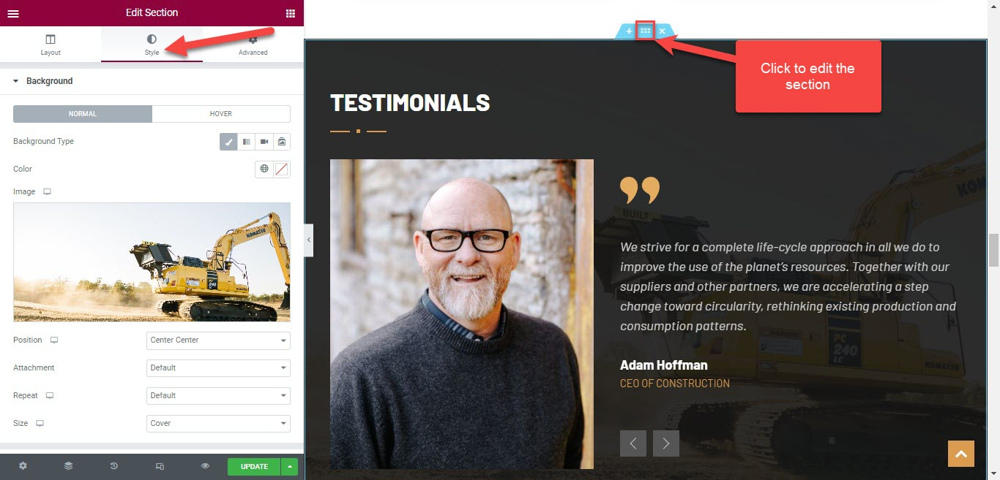

# Section Background Image

## Background image in content sections

There are some sections of the theme containing background images, so to edit it, you're supposed to edit a page with Elementor.

Scroll down to the section you need > edit the section > Style tab > Change background image

## Background image of breadcrumb section

To edit the background image of the breadcrumb section, you're supposed to edit both the  default layout in Settings, and layouts of templates.

Please go to WP-admin > Plazart Options > Settings > Layout > Edit the Breadcrumb section > Design settings > Change / upload background image

After changing the background image in the Settings, please move to the Templates section > edit your template > Layout > Edit Breadcrumb section > Design settings > background image

Edit Breadcrumb section in a layout

Change or upload background image
