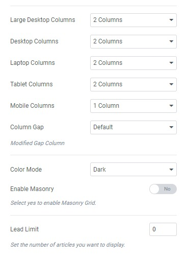

# Blog Columns

## Create a new blog page

**Step 1** - Log in to your WordPress Administration Panel (Dashboard).

**Step 2** - Click on Pages > Add New.

**Step 3** - Give your page a name then Change the Editor to Backend Editor ( you need to have the Elementor plugin activated ).

**Step 4** - Click on the Edit with Elementor button

**Step 5** - Select the WordPress widget.

In our demo, we used UI Posts widget to display blog posts.

## Blog Columns

By configuring UI Posts, you can see options to adjust the number of columns on different devices (Large desktop, desktop, laptop, tablet, and mobile phone).

## Blog Column Collapse

If you're interested in the blog collapse style, you're supposed to choose the Column gap with **"Collapse"** option.

## Blog Column Grid

To enable the column grid mode, you should scroll down to the Image Setting section of UI Posts, and choose a layout **"Thumbnail".**

