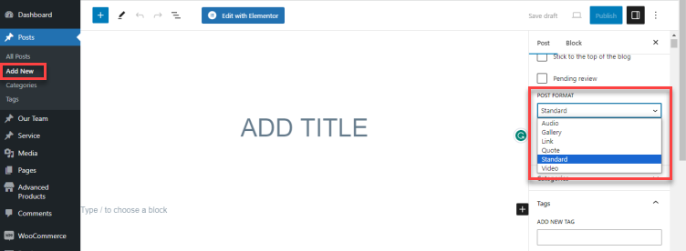

# Blog Data

In this section, we will discuss the creation of blog posts and all the available options for each post, setting up pages to display blog listings, as well as how to change the date format for your posts.

## Blog Posts

To create a new blog post, go to Posts > Add New from your WordPress admin panel. First, you need to enter a title for your blog post in the text field near the top of the screen. Then choose a format for your blog post in the Post Format section on the right side of the screen.

Let's take a look at the available blog post formats:

* **Standard** - This is the default blog format. You can start adding content with the default WordPress content editor or the Elementor Page Builder.
* **Gallery** - This format features an image gallery slider. After choosing the gallery format, you should scroll down along the right sidebar, you'll see Post Format Data to upload gallery images.

* **Video:** After choosing the Video post format in the summary section, you're supposed to scroll down along the sidebar to input the video's url or embed code from Youtube, Vimeo or other sources.

* **Audio:** After choosing the Audio Post Format, you're supposed to scroll down along the sidebar and input the auto data. Enter the auto's url or embed code.

* **Link** - After choosing the Link post type, scroll down along the sidebar to the Post format data. Here you can enter the full URL of the page you would like to link to, as well as the text you wish to display on the link.

* **Quote:** After choosing the Quote post type, you should scroll down along the sidebar to the Post Format Data. Here you can enter the quote you would like to display as well as the author of the quote. 

Now it's time to categorize this post:

1. Beneath the Format section, you will see a section named Categories. Here you can select the categories that you would like to add this post to. If you would like to create a new category, click on the + Add New Category link. A text field will appear in which you can enter a category name, and then click Add New Category.
2. Once you've selected the categories you would like to add your post to, click the Publish button. Congratulations, you've just published your first blog post!
3. Beneath the Categories section, you will see the Tags and Featured Image sections. Here you can add tags to your post and set a featured image which will be displayed for this post on blog list pages.

Now that we have published our first blog post, let’s go over the available custom fields for blog posts.

