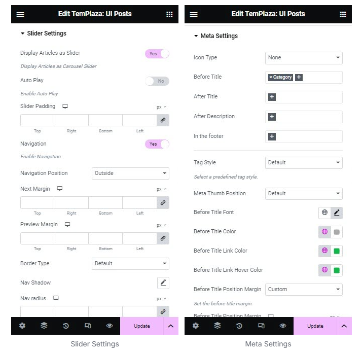

# Services

## Add new service items

In order to create a new service, go to **WP Dashboard > Services > Add New.**

The back-end view of a single service post:

## Add a new service page

After creating different service items, you should go to Pages > Add a new page > Create a new service page.

* On the right sidebar, you can choose a TemPlaza style for the page (the service page on our demo is assigned to Bicycle Full Width Image Breadcrumb)
* Click on "Edit with Elementor" to start creating more detailed content for the Services page.

The page is created with various elements including TemPlaza Heading, text editor, button, TemPlaza UI Image, TemPlaza UI Posts, icon box, and so on.

## UI Image

* **Image:** Upload an image or choose Dynamic to dynamically use Posts featured image, Site Logo, and Author Profile Picture.
* **Image Size:** Choose the size of the image
* **Border Radius:** Choose a type of border available in the drop-down list
* **Flash Effect:** Enable or disable the flash effect
* **Transition:** Choose a type of transition for the flash effect above
* **Link Type** – Set a link to a custom URL, modal, or no link. Choose “Link” to link the image to an internal or external source. Choose "Modal" to display the image with a link as a lightbox. Choose “none” if you don’t want to add a link to the image at all.

## UI Posts

This service section is created with TemPlaza UI Posts element.

### In the general settings for content:

* **Choose resource:** You can choose a resource from the Services
* **Limit:** Set the number of posts displayed in this section
* Configure the number of columns on different devices: large desktop, desktop, laptop, tablet, and mobile phone.

### Image Settings

* **Background Type:** Choose classic or gradient.
* **Color:** Set the first gradient color for the background
* **Second color:** Set the second gradient color for the background
* **Cover Image:** Choose yes to enable the image color
* **Thumbnail Height:** Set the height of the thumbnail.
* **Flash Effect:** Enable or disable the flash effect
* **Transition:** Choose a type of transition for the flash effect above

### Slider Settings

* Display articles as slider: Choose yes to enable the slider mode
* Navigation: Enable the navigation
* Navigation Position: Choose a position for the navigation

### Meta Settings

* Icon Type: You can choose an icon type from Fontawesome, UIKit or none.
* Before title: Select meta elements appearing before articles' titles
* After title: Select meta elements appearing after articles' titles
* After description: Select meta elements appearing after the articles' description

### Service Contact

This section was created with the Icon Box widget. Click on each field to edit contact info. 

### Change the background image

Click to edit the container > Style tab > Change the background image. 

## Image Carousel

Edit the image carousel widget, you're able to upload logo images of partners.

* Image size: Choose an image size from the list
* Slide to show: Set the number of images per slide
* Slide to scroll: Set the number of slides that should be scrolled per swipe
* Navigation: Choose a type of navigation

