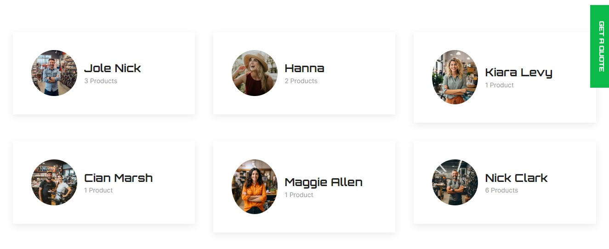
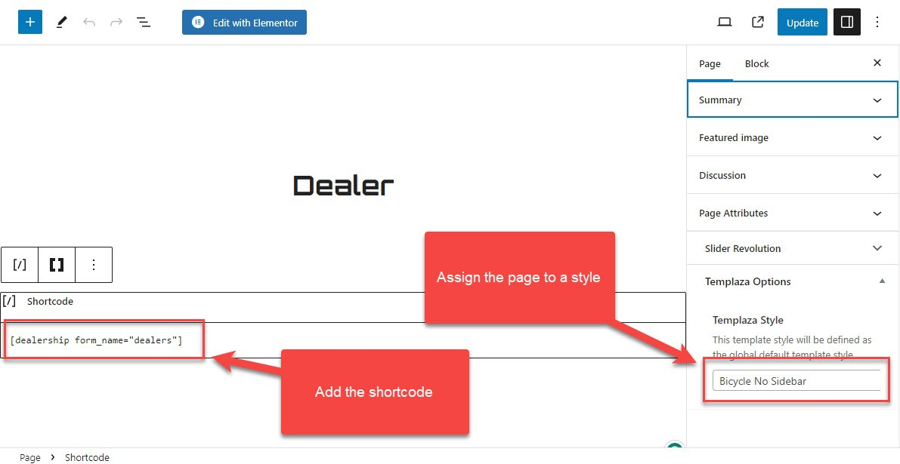

# Dealer Page

## Add a new page

Please go to **WP-admin > Pages > Add new** to create a new page for the Dealer page. 

We created this page with a shortcode, so after adding a new page, you should insert the shortcode below: 

`[dealership form_name="dealers"]`

Of course, you should make sure the Shortcode Ultimate plugin is already installed.

## Assign the page to a TemPlaza style

On the right sidebar, you can choose a Templaza style which comes from the **Probike Options > Templates.**
There you can open the style and adjust its layout to fit your needs. 

