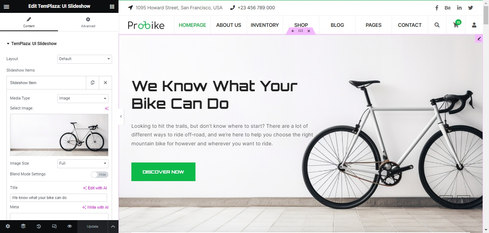
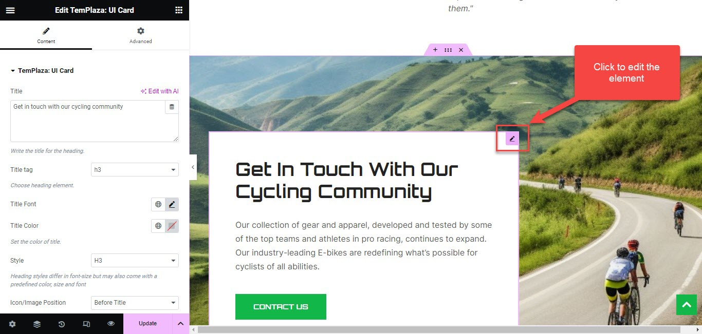
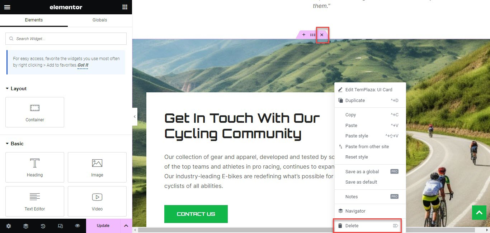
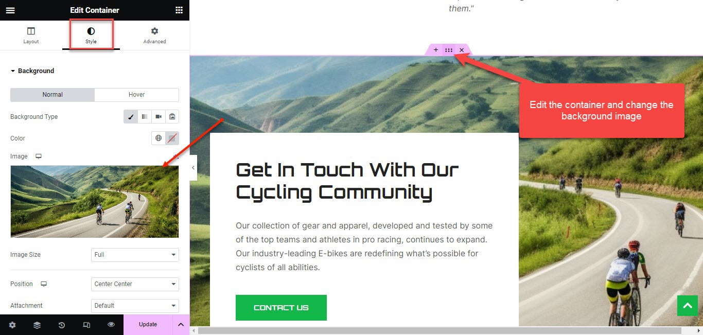
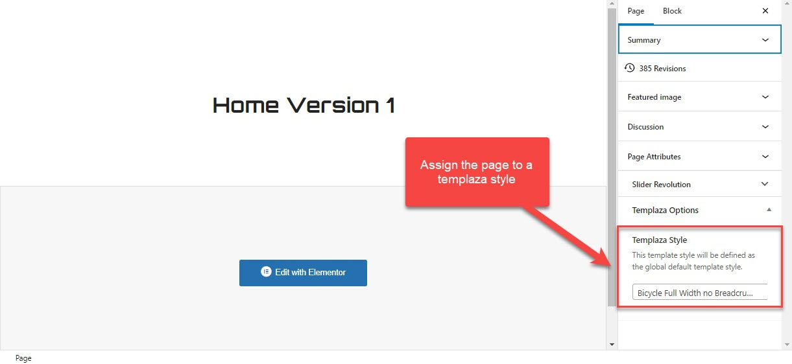
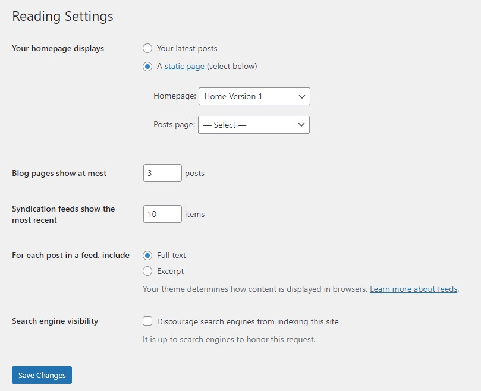

# Home Page

**Probike - Bicycle, Bike Shop WordPress Theme**

You can quickly build a home page using Elementor for WordPress which is drag and drop frontend and backend page builder plugin that will save you tons of time working on the site content. You will be able to take full control over your WordPress site, and build any layout you can imagine – no programming knowledge is required.

From your **Dashboard** admin Navigate to **Pages**

- Select **All Pages** to see all pages then click Edit one page you want

- Select **Add New** to create a new page. In that section, we guide you to create the Main page by using Elementor.

## How to use Elementor

Have you ever used Elementor ? Please follow that guide first : [Elementor guide](https://docs.elementor.com/)

[Official Plugin Documentation](https://elementor.com/) For More information about the Elementor check the official documentation.

## Add and modify Row Layout

**Step 1** - Go to your page/post, first activate the backend editor and click Edit with Elementor

**Step 2** - Click on the content section you would like to edit and start to configure options on the left. 

or you will see a button "Add New Section", and "Add Template", Please click to button to add elements.

**With add new section**, when you click on this button it will display the form for you to select a suitable structure of elementor. 

**Step 3** - To change the Row layout ( number of columns ) you need to click button content will display in left sidebar.

## Edit Element

Click on the Edit This Element (pencil icon) to Edit the Row element, when you click on the edit icon, all content will be displayed on the left sidebar and you can configure options. 

## Remove Element

To remove or delete an element, you just need to right-click and click on the delete option. Or click on the "x" icon to remove the whole container. 

## Change Background Image

To change the background image of a section, you're supposed to edit the container > Style > Change the background image.

## TemPlaza Options

You can select a TemPlaza style on the right sidebar of the page admin layout. Each page should be assigned to a specific style. If you leave it blank, it will be inherited from the default style. 

## Set a page as Home Page

**Step 1** - Go to Settings > Reading in your WordPress Dashboard panel.

**Step 2** - Set "Front page displays" to a "Static Page".

**Step 3** - In the drop-down menu for "Front Page" choose a page that will be your home page.

**Step 4** - Leave the drop-down menu for "Posts page" empty, as this is not used by the theme.

**Step 5** - Save changes.

