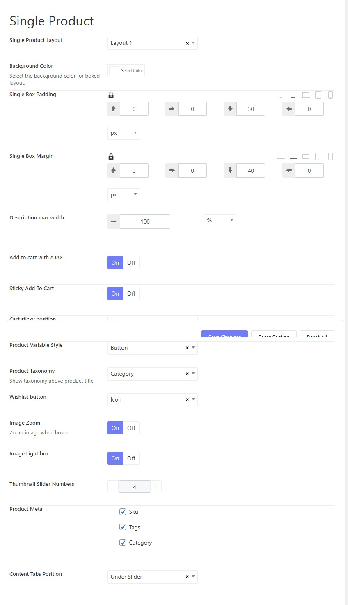

# Shop

To have the online shop page the same as our demo, you're supposed to install and activate the Woocommerce plugin.

## Add new products

We suggest that you refer to [Woocommerce documentation](https://woocommerce.com/docs/) to learn more about how to use the plugin.

## Create a new menu item for the shop page

After having done adding products, you should add a new page for the shop page. Please go to WP-admin > Pages > Add new.

TemPlaza style: Probike Shop

## Set the base page of the shop

## Woocommerce Product Options

There are a bunch of options available to configure the shop product page. You can go to **Probike Options > Settings > Woocommerce Options.**

### Product Catalog

### Product Loop

### Product Notifications

### Single Product

### Related Products

### Upsell Products

### Recent Viewed Products

Here are some options for products that customers have recently viewed. 

### Product Badges

### Product Cart

### Mini Cart

Choose a login type for the mini cart.

### Account Login

