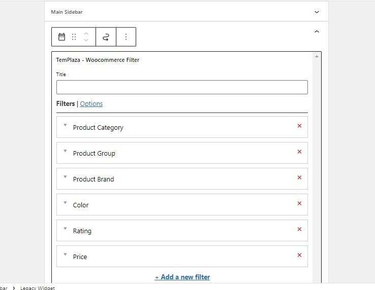
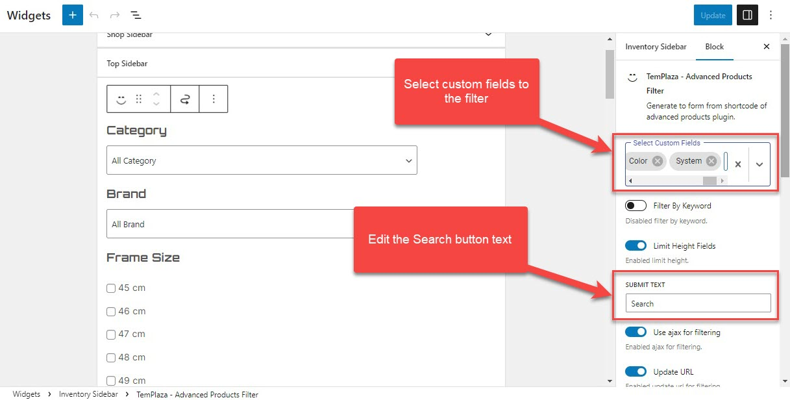
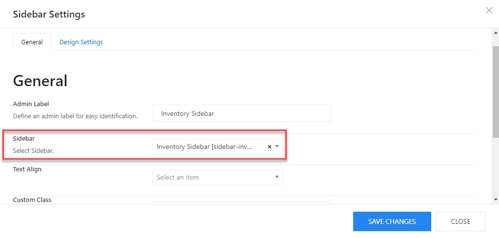

# Sidebars & Widgets

There are different pre-defined widgets that you can find in the Appearance > Widgets.

## Main Sidebar:

The main sidebar is usually located on the blog pages which are assigned to the default layout.
You can go to Probike Options > Settings > Layout > Edit the sidebar > Choose a sidebar widget.

## Shop Sidebar

The shop sidebar is located on the shop page. It's built with TemPlaza - Woocommerce Filter which allows you to add various filters to the sidebar such as Category, Brand, Group, Rating, Price, and Tags. 

Click on "Add A New Filter" to add more filters to the sidebar.

Click on the Options tab > you'll see options:

* Use ajax for filtering
* Filtering products instantly (no buttons required)
* Update URL

## Inventory Sidebar

You can find the inventory sidebar on the Inventory page. This sidebar was created with TemPlaza - Advanced Products Filter which allows you to add different advanced products filters according to custom fields (ex: Branch, Color, System, Price, Material and so on) 

* **Select custom fields:**  add custom fields to the sidebar.
* **Filter by keyword:** Enable it if you're interested in showing a field to search products by keyword.
* **Limit Height Fields:** Enable it to limit the height of fields.
* **Submit Text:** You can edit the Search button's text here.
* **Use Ajax for filtering:** Enable the option to activate ajax filtering which will hide the search call-to-action button
* **Update URL:** Update the URL when filtering custom fields.
* Filtering products instantly (no buttons required):

## General Options

* Max height: the height of the filter if it's not expanded (See less).
* Below max height are options to configure the number of columns (number of products per row) on different devices: large desktops, desktops, laptops, tablets, and mobile phones.

## Add a new sidebar

To create a new sidebar, you should go to Theme Options > Templates > Open your template (ex: Shop layout template) > Layout

* In the content area section, edit the grid layout
* Choose one of the available grid layouts or you can customize a layout according to your needs. 

Click + to add a new element to the column, then a popup appears and shows you an element panel.

Select the Sidebar element to add it to the column.

To display a widget on a sidebar, you should go to Theme Options > Templates > Open your template (ex: Shop layout template) > Layout

Edit the sidebar element > Choose a widget for the sidebar. 

