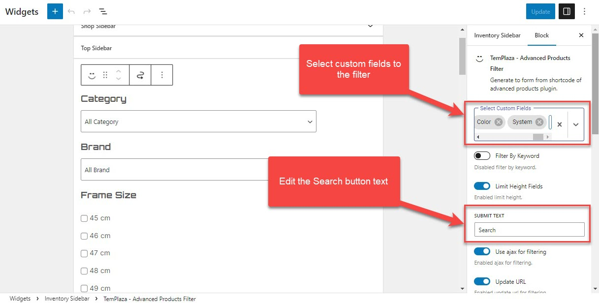

# Translation

Probike is ready to translate by using the po file. If you want to build a multilingual site, you need to use the WPML plugin. Our theme does not include the WPML plugin. It is only compatible with the WPML plugin. You have to buy a license for this plugin.

## Using Po File

We suggest that you should install Loco translate plugin. Please read the guide document for detail here: [Loco Translate.](https://wordpress.org/plugins/loco-translate/)

Here below are some common words that you may ask for translation.

## Translate Rental Units: Day, Month, Week, and Night

To change Day, Month, Week, and Night, you should go to Advanced Products > Custom Fields > Edit Rental Units (Protected field) > Choices > Change the rental units after the ":"
You shouldn't change the rental value before ":"

## Translate Words: For Sale, For Rent, Sale/Rent

To change the For Sale, For Rent labels, please go to **Theme options > Settings > Advanced Product Options > Advanced Product Badge >** edit For Sale label, For Rent label, Sale/Rent label.

About the word "All", you should go to Loco Translate plugin > plugins > TemPlaza Framework > Install your language > Search and translate the word

`[Plugins / Templaza Framework / templaza-framework-en_US.po (author)]`

## Translate "Share This" and "Make An Office Price"

Go to **Theme Options> Settings > Advanced Product Options > Advanced Product Single >** You can see Office Price Label and Share Label.

## Translate "Add To Compare"

You should go to Loco Translate / Plugins / Advanced Product / advanced-product-en_US.po (system)
Create your language and start to search and translate the word.

## Translate "Vendor Profile" and "Contact Vendor"

Go to Loco Translate plugin > Themes > Autobike > en_US.po (author) > Create your language and start to search and translate the words.

## Translate "All", "Keyword:", and "Search ..." (placeholder text) in the sidebar filter on the Inventory page

Go to Loco Translate plugin > Plugins > Advanced Product > advanced-product-en_US.po (system) > Create your language and start to translate. 

About custom fields names, you should go to Advanced Products > Custom fields > Edit fields' labels. 

:::note

For protected custom fields, you should edit field names only, don't try to edit or modify field names, which will mess the site up. 

:::

## Translate "Sort By" Date: Newest First, Date: Oldest First, Title: A - Z, Title: Z - A, Price: High To Low, Price: Low To High

Go to Loco Translate plugin > Plugins > Advanced Product > advanced-product-en_US.po (system) > Create your language and start to translate.

## Translate "Product Available"

Go to Loco Translate plugin > plugins > TemPlaza Framework >  templaza-framework-en_US.po (author) > Install your language > Search and translate the word.

## Change the "Search" button text on the Inventory Sidebar

If you want to change the search button text in the filter, go to Appearance > Widgets > Inventory Sidebar > TemPlaza - Advanced Products Filter.

You can see the Submit text on the right sidebar.

