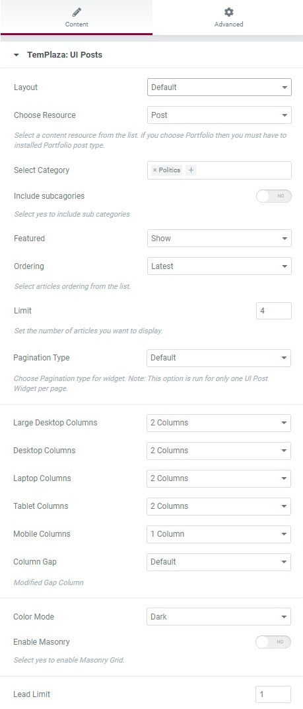
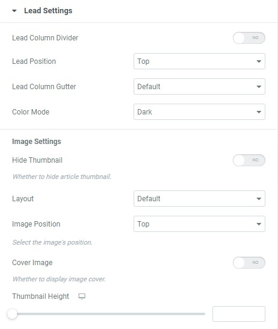
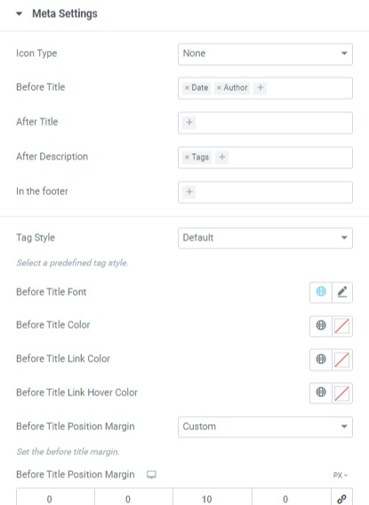
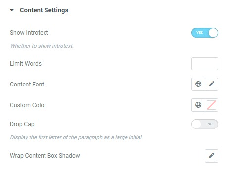
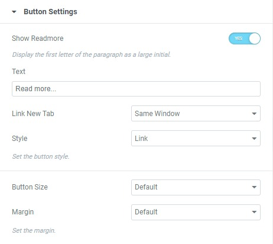

# Blog Pages

World, Climate, Politics, Science & Tech, Business, and Travel

## Blog layouts

The theme was created with different blog layouts for different topics.

* **World:** Default layout
* **Politics:** 1 Featured + Grid 2 Columns
* **Climate:** 2 grid columns
* **Science & tech:** 1 featured + image left
* **Business:** blog left image
* **Travel:** blog right image

To create blog pages including world, climate, travel, business, science & tech, and politics, you should create new pages, edit pages with Elementor > drag and drop UI Posts and configure available options.

## UI Post Settings

UI Post settings allow you to choose the content resource, and categories, hide or show featured articles, select the ordering, limit the number of posts, pagination type (default or ajax loading) and so on.

## Leading Settings

In the Lead Settings, you will find tons of options to manage the leading post. You can configure the image, button, content, meta, card, title, and more. 

## Image Settings

In the image settings, you're able to manage the image position (left, right, top, bottom or inside body)

If you choose Image left or right, you can also adjust the image width on different devices (large desktop, desktop, laptop, tablet, and mobile phone)

## Meta Settings

In the meta settings, you can choose to display the author, category, date, tag and so on. It's up to you to decide which one should be presented before title, after title, after description or in the footer.

## Content Settings

In the Content Setting, you can show or hide intro text, limit words, adjust the content font, color, or even enable drop cap.

## Button Settings

Showing the read more button and editing the read more text is easily configured in the button settings. 

Moreover, you can adjust the button size, and button style and set the margin. 

