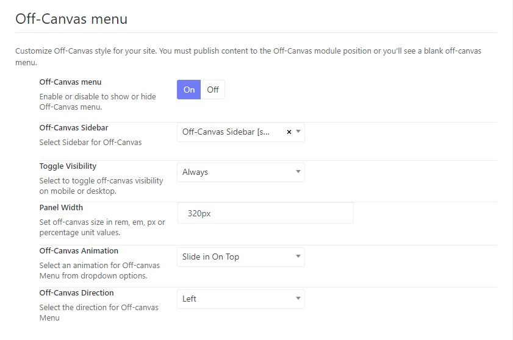

# Off-Canvas Sidebar

## Edit the Off-canvas sidebar content

Plz go to Wp-dashboard > Appearance > Widgets > Edit Off-canvas Sidebar 

## Enable or disable the off-canvas sidebar

You can go to Today News Options > Header > Header > Off-Canvas Menu > Enable or disable to show or hide the mOff-Canvas menu.

Choose the off-canvas sidebar, set the off-canvas panel width, animation and direction. 

