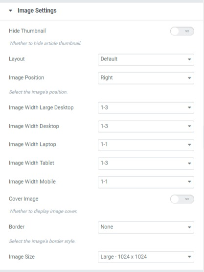

# Blog Default

By using TemPlaza - UI Posts, In the Image Settings tab, you can see the Image Position option which allows you to choose an Image position.

* Image left: Thumbnail images appear on the left, and excerpts are on the right.
* Image right: Thumbnail images appear on the right, and excerpts are on the left.
* Image bottom: The thumbnail image is placed under the title and excerpt
* The image inside the content box: The thumbnail is placed above the title and excerpt.

With Left and Right image positions, you can configure the image width on different devices: large desktops, desktops, laptops, tablets, and mobile phones.

