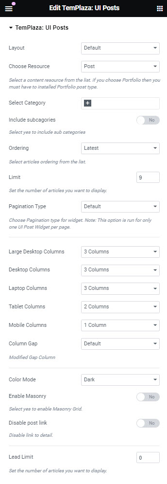
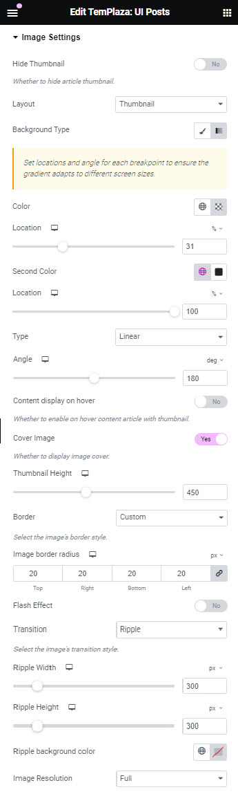

# Blog Grid

Blog grid is designed to display a grid of blog articles on a page. You're supposed to create a new page and edit the page with Elementor. Adding UI Posts to the page and start configuring options. 

In general, you can configure the number of columns on devices, limit articles, and select an article order. 

## Blog Grid - Image settings

* To achieve the grid style, you should choose a layout "Thumbnail".
* Enable cover image
* Image resolution: Full

