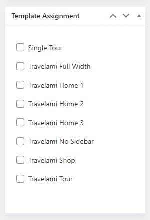
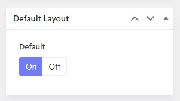

# Theme's Header

The Home Page 1 is assigned to Header 1, while Home 2 and Home 3 are assigned to Header 2 and Header 3 respectively. 

You can go to Travelami Options > Headers > There you can see 3 prebuilt header templates > Open Travelami Default.

Open each header template, you will see options to configure the header logo, header layout and others.

## Header modes

There are many header modes for you to choose from, including Horizontal, Stacked, and Sidebar.

## Header Block 1

Block 1 is a position where you can place a widget, contact info, and a custom html, It can be on the right of a horizontal menu, below the stacked menu, and at the bottom of the sidebar menu.

## Header Assignment

When editing each header, you can see the template Assignment which allows you to assign the header to templates you want. 

**In case you would like to apply the header to all the pages, just need to enable the default layout option.** 

