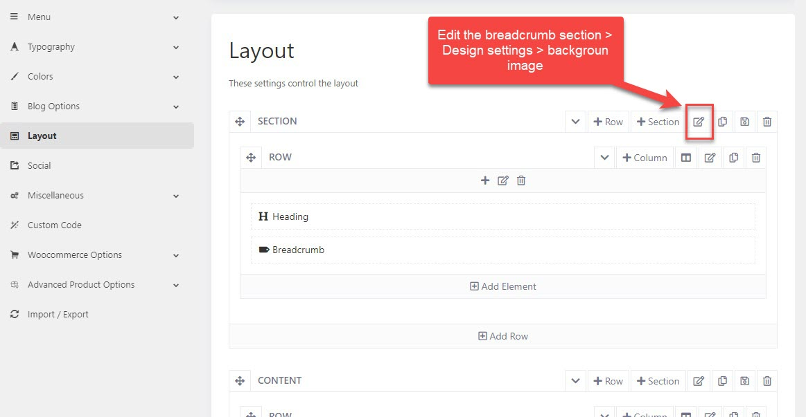
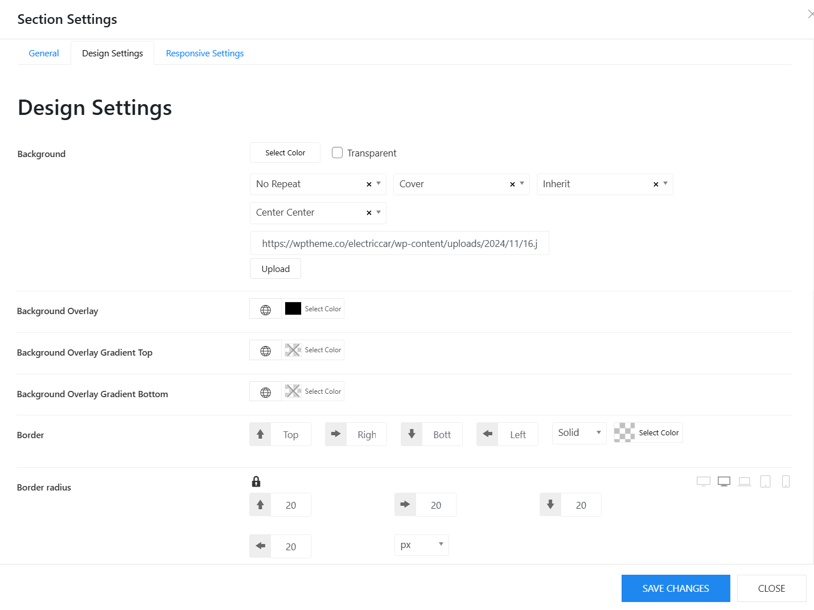

# Background of breadcrumb

To edit the background image of the breadcrumb section, you're supposed to edit both the  default layout in Settings, and layouts of templates.

Please go to WP-admin > Vonux Options > Settings > Layout > Edit the Breadcrumb section > Design settings > Change / upload background image

After changing the background image in the Settings, please move to the Templates section > edit your template > Layout > Edit Breadcrumb section > Design settings > background image

Click on Upload to select your image. Right below is the Background Overlay option. And you can also adjust the border radius here for the breadcrumb image.

