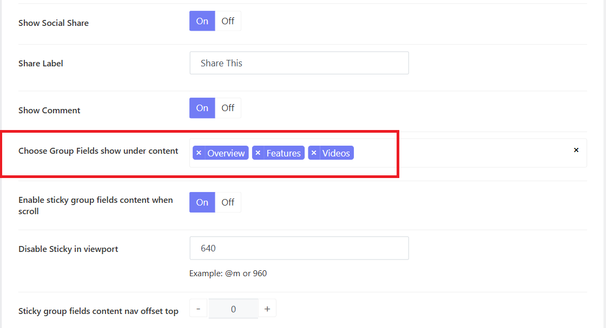
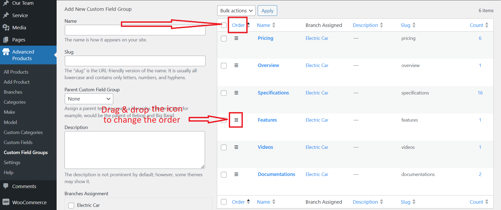
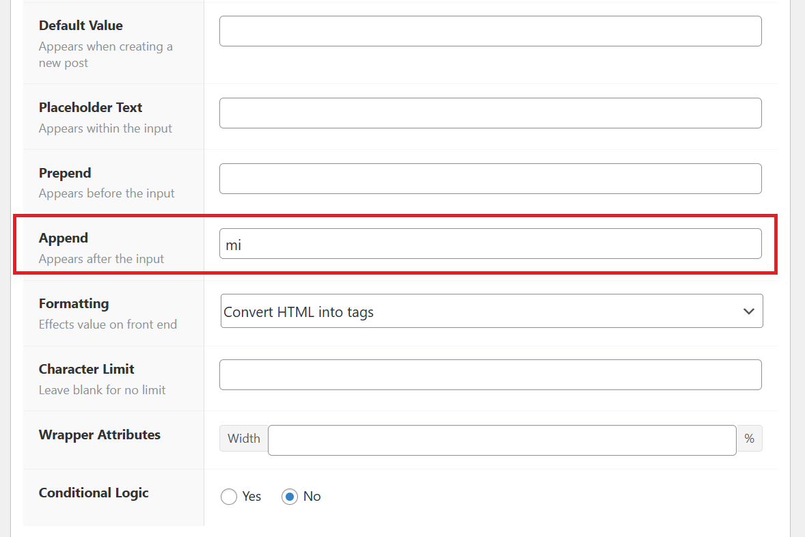

# Inventory FAQs

## 1.How to add or remove product tabs

You can see there are 3 main tabs on the single advanced product page (**Overview, Features, and Videos**). You can go to **Vonux Options > Settings > Advanced Products Options > Advanced Products Single >** Choose group fields show under content. Here you can add more or remove each one.

## 2.How to reorder the product tabs

In case you would like to reorder these product tabs, you should go to Advanced Products > Custom Fields Groups > Click on the **"Order"** to activate the custom order.

Then drag and drop the icon in front of each field group to create a suitable order. 

## 3.How to change the field unit

For example: the field Mileage is attached with the Mi unit after each value. To change the unit, you can go to **Advanced Products > Custom Fields > Navigate the Mileage field >** Change the Apprend option. 

